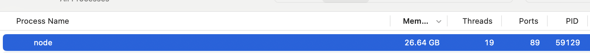
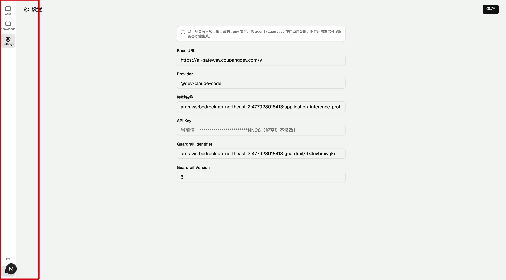
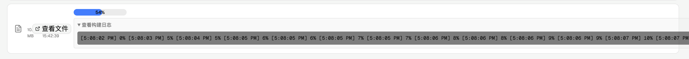

本地模型使用 qwen3.5
- 使用了 react-i18next
- UI 功能不正确，语言切换无效
- 没有替换 UI 所有的文案

本地模型内存从 9G 上升到 26G

devin Claude sonnet 4.6 thinking
- 自己实现 translation 的逻辑（根据 json object map 对应的字段路径）
- 能正确地使用 provider 和 hooks
- UI 功能正常，语言可以切换
- UI 所有的文案都能找到
- 代码风格良好，注释清晰

# 例子：完善 RAG 日志
本地模型
- UI 错误：无法正确显示日志内容，且日志内容只有进度，没有详细信息，而进度信息早就有了
